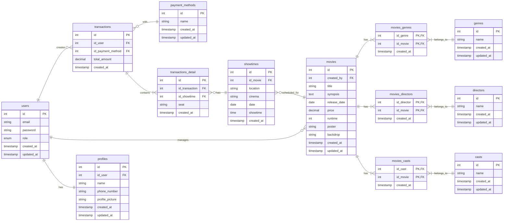

# Project Backend Go - Tickitz

This project was made by Muhammad Davinda Rinaldy in Kodacademy Training Program. This project uses Go Language to make a backend application for tickitz, uses PostgreSQL for the SQL database and uses Redis for the NoSQL database.

Endpoint included in this project:
1. Auth (Register, Login, Forgot Password, Reset Password, Logout)
2. User (Update Profile/Credentials, Get Profile Data)
3. Movies (Get Movies, Get Detail Movie, Get Upcoming Movie, Get Genres, Get Directors, Get Casts, Add Genre, Add Director, Add Cast, Add Movie, Update Movie, Delete Movie) 
4. Transactions (Add Transaction, Get Transaction History, Get Reserved Seats, Get Payment Method, Add Payment Method, Get Sales Data) 

## Prerequisites

Make sure you already install Go to run this project

## How to Run this Project

1. Create a new empty directory for the project and navigate into it
2. Clone this project into the empty current directory:
```
git clone https://github.com/mdavindarinaldy/fgo24-be-tickitz.git .
``` 
3. Install dependencies
```
go mod tidy
```
4. Run the project
```
go run main.go
```

## Database Schema

### SQL DB: Entity Relationship Diagram



### NoSQL DB:
- **otp**: Stores one-time passwords (OTPs) as a string with user id as the key, containing the OTP code and expiration time for verification purposes.
- **blacklist_tokens**: Stores blacklisted JWT tokens as a set with a single key, containing token strings to invalidate them after user logout, ensuring they cannot be used even if they have not yet expired.

## Endpoints Overview
| Method    | Endpoint | Description | Auth | Role |
| -------- | -------  | ------- | ------ | ------ |
| POST  | /auth/register | Create new user | No | - |
| POST  | /auth/login | Login | No | - |
| PATCH  | /auth/pass | Change password with OTP | No | - |
| PATCH  | /auth/pass | Change password with OTP | No | - |
| POST  | /auth/logout | Logout | Yes | User/Admin |
| PATCH  | /user | Update user's data | Yes | User |
| GET  | /user | Get user's data | Yes | User |
| GET  | /movies | Get all movies data | No | - |
| GET  | /movies/:id | Get one movie data | No | - |
| GET  | /movies/upcoming | Get all upcoming movie | No | - |
| GET  | /movies/genres | Get all genres | Yes | Admin |
| GET  | /movies/directors | Get all directors | Yes | Admin |
| GET  | /movies/casts | Get all casts | Yes | Admin |
| POST  | /movies/genres | Add new genre | Yes | Admin |
| POST  | /movies/directors | Add new director | Yes | Admin |
| POST  | /movies/casts | Add new cast | Yes | Admin |
| POST  | /movies | Add new movie | Yes | Admin |
| PUT  | /movies/:id | Update movie's data | Yes | Admin |
| DELETE  | /movies/:id | Delete movie | Yes | Admin |
| POST  | /transactions/payment-methods | Add new payment method | Yes | Admin |
| GET  | /transactions/payment-methods | Get all payment methods | Yes | User/Admin |
| POST  | /transactions | Add new transactions | Yes | User |
| GET  | /transactions | Retrieve all transactions history per user | Yes | User |
| GET  | /transactions/seats | Retrieve all reserved seats for specific showtime | Yes | User |
| GET  | /transactions/sales | Get sales data per movie | Yes | Admin |

## Dependencies
This project use:
1. gin-gonic from github.com/gin-gonic/gin : for handling HTTP request/response data (gin.Context), for defining middleware and route handlers (gin.HandlerFunc), for organizing routes into groups (gin.RouterGroup) and for managing HTTP routing and server configuration (gin.Engine)
2. jwt v5 from github.com/golang-jwt/jwt/v5 : for creating, parsing and validating JSON Web Tokens (JWT) for authentication and authorization
3. pgx from github.com/jackc/pgx/v5 : for direct database interactions (PostgreSQL)
4. godotenv from github.com/joho/godotenv : for loading environment variables from a .env file into the application
5. go-redis from github.com/redis/go-redis/v9 v9.11.0: for interacting with Redis, enabling caching, session management, and OTP storage.
6. swaggo from github.com/swaggo/swag v1.16.4, github.com/swaggo/files v1.0.1, and github.com/swaggo/gin-swagger v1.6.0: for generating and serving Swagger API documentation for the application's endpoints.
7. argon2 from github.com/matthewhartstonge/argon2 v1.3.2: for securely hashing and verifying passwords using the Argon2 algorithm.

## Basic Information
This project is part of training in Kodacademy Bootcamp Batch 2 made by Muhammad Davinda Rinaldy
