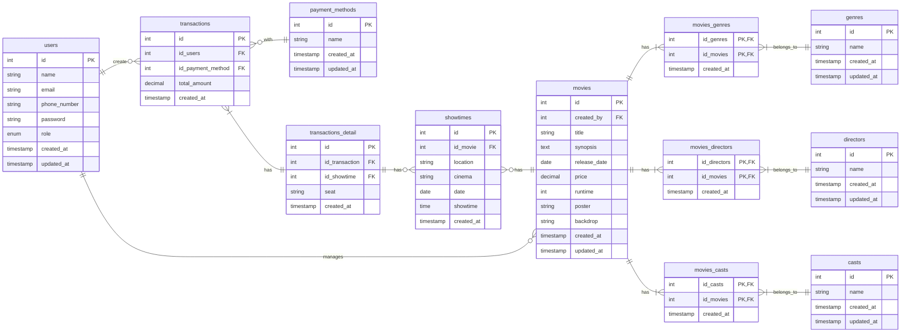

## Entity Relationship Diagram

```mermaid
erDiagram
    direction LR
    users {
        int id PK
        string name
        string email
        string phone_number
        string password
        enum role
        timestamp created_at
        timestamp updated_at
    }
    movies {
        int id PK
        int created_by FK
        string title
        text synopsis
        date release_date
        decimal price 
        int runtime
        string poster
        string backdrop
        timestamp created_at
        timestamp updated_at
    }
    genres { 
        int id PK
        string name
        timestamp created_at
        timestamp updated_at
    }
    movies_genres {
        int id_genres PK,FK
        int id_movies PK,FK
        timestamp created_at
    }
    directors {
        int id PK
        string name
        timestamp created_at
        timestamp updated_at
    }
    movies_directors {
        int id_directors PK,FK
        int id_movies PK,FK
        timestamp created_at
    }
    casts {
        int id PK
        string name
        timestamp created_at
        timestamp updated_at
    }
    movies_casts {
        int id_casts PK,FK
        int id_movies PK,FK
        timestamp created_at
    }
    payment_methods {
        int id PK
        string name
        timestamp created_at
        timestamp updated_at
    }
    transactions {
        int id PK
        int id_users FK
        int id_payment_method FK
        decimal total_amount
        timestamp created_at
    }
    showtimes {
        int id PK
        int id_movie FK
        string location
        string cinema
        date date
        time showtime
        timestamp created_at
    }
    transactions_detail {
        int id PK
        int id_transaction FK
        int id_showtime FK
        string seat
        timestamp created_at
    }
    movies ||--|{ movies_genres: has
    movies_genres }|--|| genres: belongs_to

    movies ||--|{ movies_directors: has
    movies_directors }|--|| directors: belongs_to

    movies ||--|{ movies_casts: has
    movies_casts }|--|| casts: belongs_to

    users ||--o{ transactions: create
    users ||--o{ movies : manages
    transactions }o--|| payment_methods: with
    transactions }|--|| transactions_detail: has
    showtimes }o--|| movies : has
    transactions_detail ||--o{ showtimes: has
```

    